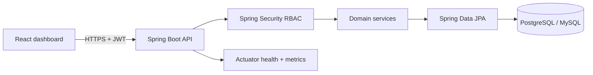

# Finance Core System

A production-oriented personal finance platform built with Spring Boot, React, TypeScript, PostgreSQL, and Docker. Finaxis combines a secure RBAC API with a responsive dashboard for transaction management and spending analytics.

## What is included

- JWT authentication with short-lived signed tokens
- Server-enforced `VIEWER`, `ANALYST`, and `ADMIN` roles
- Income and expense CRUD with pagination, search, date filtering, and soft deletion
- Balance, income, expense, transaction-count, and category analytics
- Admin user activation and role management without exposing credentials
- React 19 + TypeScript dashboard bundled into the Spring Boot application
- PostgreSQL migrations through Flyway, while retaining MySQL compatibility
- Health/readiness probes, graceful shutdown, trace IDs, and structured API errors
- Transactional, admin-readable audit history for financial and privileged mutations
- Database-backed idempotency keys that prevent duplicate writes during retries
- Timed account lockout after repeated credential failures
- Prometheus metrics and documented SLO/error-budget policy
- Real PostgreSQL migration validation with Testcontainers in CI
- Multi-stage, non-root Docker image
- GitHub Actions CI, CodeQL scanning, Dependabot, and JaCoCo reports
- Render Blueprint and Docker Compose deployment paths

## Architecture



The application is delivered as one container. The frontend is built first and included in the executable Spring Boot JAR, which removes cross-origin complexity in production.

## Roles

| Capability | Viewer | Analyst | Admin |
|---|:---:|:---:|:---:|
| View dashboard and transactions | Yes | Yes | Yes |
| Create, update, and delete transactions | No | Yes | Yes |
| Manage users and roles | No | No | Yes |

Public registration always creates a `VIEWER`. An administrator can promote the account after reviewing access needs.

## Run with Docker

Prerequisites: Docker with Compose support.

```bash
docker compose up --build
```

Open:

- Dashboard: `http://localhost:8080`
- Swagger UI: `http://localhost:8080/swagger-ui.html`
- Readiness: `http://localhost:8080/actuator/health/readiness`

The local administrator is configured in `docker-compose.yml`. Change the example credentials before sharing the environment.

## Local development

Prerequisites: Java 17+, Node.js 24+, and Docker/PostgreSQL when using the production profile.

Frontend:

```bash
cd frontend
npm ci
npm run dev
```

Backend with the in-memory development database:

```bash
./mvnw spring-boot:run
```

Vite proxies `/api` and `/actuator` to port `8080`.

Run all checks:

```bash
cd frontend
npm ci
npm run build
cd ..
./mvnw clean verify
```

## Configuration

Copy `.env.example` and set secrets in the deployment platform rather than committing them.

| Variable | Purpose |
|---|---|
| `SPRING_PROFILES_ACTIVE` | Use `prod` for PostgreSQL + Flyway |
| `DB_HOST`, `DB_PORT`, `DB_NAME` | PostgreSQL connection |
| `DB_USER`, `DB_PASSWORD` | Database credentials |
| `JWT_SECRET` | Random signing secret, minimum 32 characters |
| `JWT_ACCESS_TOKEN_TTL` | ISO-8601 duration such as `PT1H` |
| `CORS_ALLOWED_ORIGINS` | Comma-separated trusted frontend origins |
| `ADMIN_EMAIL`, `ADMIN_PASSWORD` | Optional first-admin bootstrap credentials |

Bootstrap credentials are only used when the configured email does not already exist. Use a unique password of at least 12 characters and remove/rotate the variable after the first successful deployment.

## API overview

| Method | Endpoint | Access |
|---|---|---|
| `POST` | `/api/auth/register` | Public |
| `POST` | `/api/auth/login` | Public |
| `GET` | `/api/dashboard/summary` | Authenticated |
| `GET` | `/api/records` | Viewer+ |
| `GET` | `/api/records/filter` | Viewer+ |
| `POST` | `/api/records` | Analyst+ |
| `PUT` | `/api/records/{id}` | Analyst+ |
| `DELETE` | `/api/records/{id}` | Analyst+ |
| `GET` | `/api/users` | Admin |
| `PUT` | `/api/users/{id}/role` | Admin |
| `PUT` | `/api/users/{id}/activate` | Admin |
| `PUT` | `/api/users/{id}/deactivate` | Admin |
| `GET` | `/api/audit-events` | Admin |

`POST /api/records` requires an `Idempotency-Key` header containing 8-128 URL-safe
characters. A client may safely retry the same payload with the same key.

Swagger's **Authorize** dialog accepts the token returned by login.

## Deploy to Render

`render.yaml` provisions:

1. A Docker web service.
2. A PostgreSQL database.
3. A generated JWT signing secret.
4. Health checks against the readiness endpoint.

Create a Render Blueprint from this repository. During setup, provide:

- `CORS_ALLOWED_ORIGINS`: the final application origin, for example `https://your-service.onrender.com`
- `ADMIN_EMAIL`: the first administrator email
- `ADMIN_PASSWORD`: a strong one-time bootstrap password

The first deploy runs the Flyway migration, creates the optional administrator, builds the React application, runs backend tests, and packages the non-root runtime image.

## Security notes

- Passwords use BCrypt with cost factor 12 and are never serialized.
- JWT signing material comes from the environment, not source control.
- Every authenticated request resolves the current user from the database, so deactivation and role changes take effect immediately.
- Record lookups are scoped to the authenticated owner to prevent cross-account access.
- Validation errors are safe and specific; unexpected exceptions do not expose stack traces.
- Authentication failures return `401`; role failures return `403`.

For vulnerability reporting, see [SECURITY.md](SECURITY.md).

Engineering references:

- [Architecture and correctness model](docs/architecture.md)
- [Service-level objectives](docs/slo.md)
- [Threat model](docs/threat-model.md)
